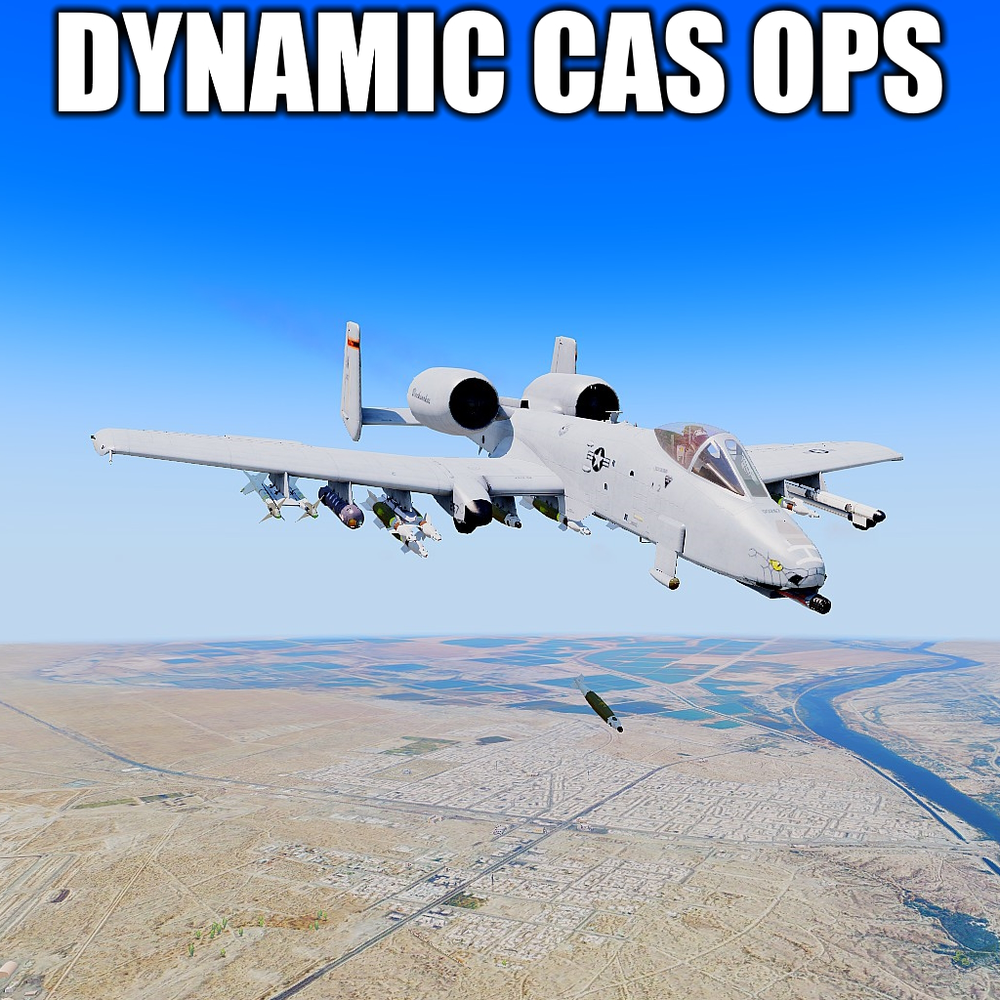

    

   Dynamic-CAS-Ops-South 

----

这个项目的来源于
     
<a href = "https://steamcommunity.com/id/MrSocomDude">MrSocomDude</a>作品<a href = "https://steamcommunity.com/sharedfiles/filedetails/?id=2949924505&searchtext=Dynamic+CAS+Ops/">Dynamic CAS Ops - South Asia</a>

     

# Dynamic-CAS-Ops-South 

**Dynamic CAS Ops - South Asia 由MrSocomDude作者开发**

 **本任务是在其任务的基础上进行的二次更改**

## 关于

这是一个arma3的持续的任务文件源码，以下是steam创意工坊对其任务的简介翻译

- 使用虚拟车库生成喷气式飞机并定制武器挂架、外观和部件：此任务允许您从已安装的任何模块生成任何喷气式飞机或直升机。您还可以访问虚拟车库，使用不同的武器和装备定制您的挂架，例如反辐射导弹、雷达制导反坦克导弹和智能炸弹，甚至是外部油箱（如果车辆支持）。您还可以保存和分享您的配置。-

- 兼容所有飞机模块：此任务与任何飞机模块兼容，您可以驾驶任何飞机，从原始喷气式飞机到改装的飞机，如 F/A-18、Su-35、FIR F-16 甚至其他飞机，如星球大战共和国武装直升机或 Optre Halo 飞机。-

- 完全动态 AO：此任务将在指定的作战区域中快速生成随机敌方目标和防御。您可以在开始任务之前选择 AO 的密度和目标组合。

- 动态车队：敌方车队将在地图上随机生成，并设定起点和目的地。利用设置中设置的派系，敌方车辆将尝试到达目的地以支援敌军，您必须摧毁它们！

- 城市 AO：全副武装的步兵可以在城市边界内得到很好的防御，使地面围攻非常致命。消除防空并削弱敌人，以便更容易进行地面入侵！！

- 附带损害：敌方步兵有时可以在医院等敏感的平民目标附近得到防御。
避免战争罪行，不要炸毁平民目标！！！

- AO 参数可调：您还可以自定义敌军的难度和多样性。您可以启用或禁用敌方防空系统、喷气式飞机、直升机、地面车辆和步兵。您还可以设置敌方单位的具体数量。这些参数可以快速调整以适应快节奏的游戏。

- 敌方防空武器：任务中将产生各种类型的敌方防空武器，例如 Tigris 和配备便携式防空导弹的敌方小队。您必须使用雷达、对抗措施和规避机动来避免被击落。

- 敌方喷气式飞机和直升机：任务中还将产生各种混合的敌方战斗机和攻击直升机，它们将试图拦截您。您必须与它们展开惊心动魄的缠斗，或使用隐身战术偷偷溜过它们。
这些敌人的数量和频率可以在游戏中调整，以获得真正动态的缠斗体验。

- 宙斯：访问强大的宙斯界面，让您完全自定义您的体验。按Y激活

